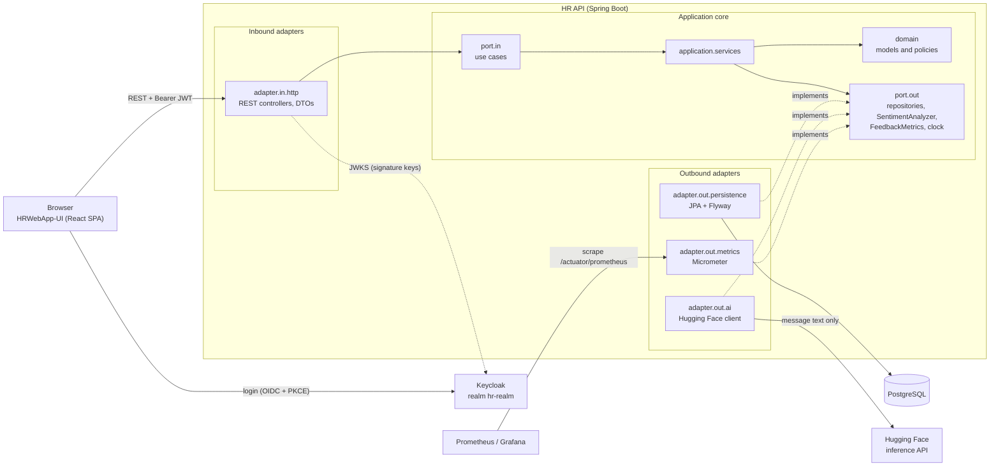
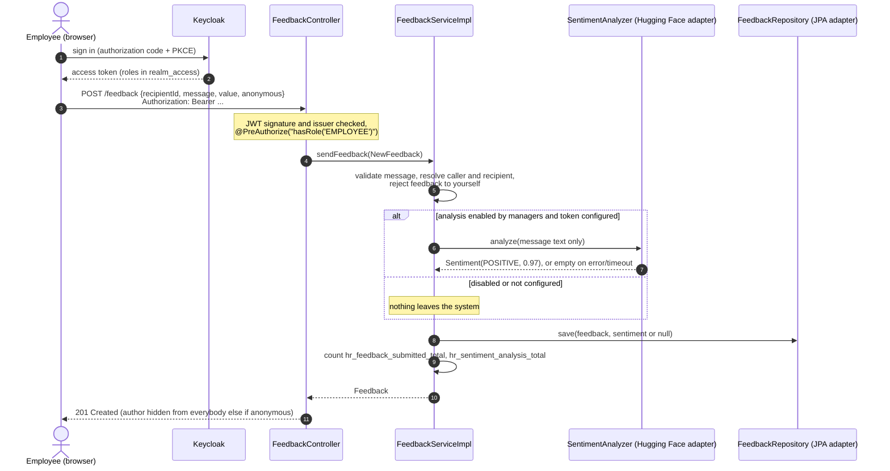

# HRWebApp

[](https://github.com/jacidProgrammer/HRWebApp/actions/workflows/ci.yml)
[](https://github.com/jacidProgrammer/HRWebApp/actions/workflows/codeql.yml)
[](https://github.com/jacidProgrammer/HRWebApp/actions/workflows/ci.yml)
[](https://openjdk.org/projects/jdk/25/)
[](https://spring.io/projects/spring-boot)
[](LICENSE)

**A peer-recognition and HR-insights API with privacy built in: Spring Boot 3.5 on Java 25, hexagonal architecture,
Keycloak-secured, with AI sentiment analysis that degrades gracefully.**

Employees recognise colleagues (optionally anonymously) for company values; managers get a dashboard with trends and
aggregated alerts, and decide whether the AI sentiment analysis runs at all. The React frontend lives in
[HRWebApp-UI](https://github.com/jacidProgrammer/HRWebApp-UI).

| Manager dashboard | Giving recognition | Employee profile (dark mode) |
|---|---|---|
|  |  |  |

## Try it

**Live demo, nothing to install:** <https://jacidprogrammer.github.io/HRWebApp-UI/>. The UI runs in mock mode there,
with an in-browser fake of this API.

**The real thing, one command** (needs Docker; builds this API and the UI straight from its Git repository):

```bash
docker compose --profile full up -d --build
```

| What               | Where                                            | Credentials                                  |
|--------------------|--------------------------------------------------|----------------------------------------------|
| UI                 | <http://localhost:5173>                          | `manager`, `jose`, `louisa`, `maria`, `lukas` / `1234` |
| API + Swagger UI   | <http://localhost:8080/swagger-ui.html>          | bearer token from Keycloak                   |
| Keycloak           | <http://localhost:8082>                          | admin console `admin` / `admin`              |
| Prometheus, Grafana | <http://localhost:9090>, <http://localhost:3000> | with `--profile observability`; Grafana `admin` / `admin` |

Stop it with `docker compose --profile full down` (add `-v` to delete the data). Host ports can be changed with
`API_PORT`, `KEYCLOAK_PORT`, `HR_DB_PORT`, `KEYCLOAK_DB_PORT`, `PROMETHEUS_PORT` and `GRAFANA_PORT`; keep the UI on
5173, the redirect URI registered in the Keycloak realm. Set `HUGGINGFACE_TOKEN` to get real sentiment analysis;
without it everything works and new feedback is stored without sentiment. All credentials are local demo values.

## Highlights

- **Recognition with privacy by design.** Anonymous feedback stays anonymous for managers too, alerts are aggregated
  and need a minimum sample, employees only see what concerns them ([ADR 0003](docs/adr/0003-anonymous-feedback-privacy-by-design.md)).
- **AI that is optional.** Sentiment analysis (Hugging Face) sits behind a port that never fails a request; managers
  can switch it off at runtime, and then nothing leaves the system ([ADR 0005](docs/adr/0005-sentiment-analysis-behind-a-port.md)).
- **Manager insights.** Headcount, feedback volume, monthly sentiment trend, recognised values, most recognised people
  and "positive share dropped" alerts in one `GET /stats/overview`.
- **Security.** Keycloak (OIDC, PKCE for the SPA), stateless JWT resource server, deny by default, role checks with
  `@PreAuthorize`, field-level visibility for salary and address ([ADR 0002](docs/adr/0002-keycloak-jwt-resource-server.md)).
- **A contract, not a guess.** The OpenAPI document is committed and checked in CI; the UI generates its TypeScript
  types from it ([ADR 0006](docs/adr/0006-openapi-contract-between-repos.md)).
- **Production habits.** Flyway migrations, layered non-root Docker image, health probes, Prometheus metrics with
  business counters, JSON logs with request correlation ids, CodeQL, Dependabot, 200+ tests including
  Testcontainers PostgreSQL.

## Architecture



The services only see ports and domain objects; web DTOs and JPA entities stay in their adapters and are mapped with
MapStruct, so the JSON contract, the schema and the external API can change independently of the use cases
([ADR 0001](docs/adr/0001-hexagonal-architecture.md)).

```
dev.jacid.hrApplication
├── domain                 Employee, Feedback, Sentiment, AppSettings, dashboard records; EmployeeUpdatePolicy, StatsCalculator
├── application
│   ├── port.in            EmployeesUseCases, FeedbackUseCases, StatsUseCases, SettingsUseCases
│   ├── port.out           EmployeeRepository, FeedbackRepository, SettingsRepository, SentimentAnalyzer,
│   │                      FeedbackMetrics, CurrentUserProvider, TimeProvider
│   └── services           use case implementations (visibility rules, sentiment gate)
├── adapter
│   ├── in.http            REST controllers, DTOs, MapStruct mappers, OpenAPI annotations
│   ├── out.persistence    Spring Data JPA entities and repositories
│   ├── out.ai             Hugging Face client
│   └── out.metrics        Micrometer counters
└── infrastructure         security (Keycloak JWT), request id filter, OpenAPI, clock, demo data seeder, error handling
```

### Giving recognition



## Tech stack

- Java 25, Spring Boot 3.5: Web, Security, OAuth2 Resource Server, Data JPA, Validation, Actuator
- Keycloak 26 (OIDC), PostgreSQL 15 (H2 for quick local runs), Flyway
- MapStruct, Lombok, Spring `RestClient` for the Hugging Face inference API
- springdoc-openapi, Micrometer + Prometheus, Grafana, ECS structured logging
- JUnit 5, Mockito, MockMvc, Spring Security Test, Testcontainers, JaCoCo
- Docker, GitHub Actions, CodeQL, Dependabot

## Developing locally

Requirements: JDK 25 and Docker. Maven comes with the wrapper (`./mvnw`).

1. **Start Keycloak and the databases** (no profile: infrastructure only):

   ```bash
   docker compose up -d
   ```

   Keycloak runs on `http://localhost:8082` and imports the `hr-realm` realm from
   [`realm-export/hr-realm.json`](realm-export/hr-realm.json) the first time. The realm has the roles `MANAGER` and
   `EMPLOYEE`, the public client `hr-api-login` (authorization code + PKCE for the UI on `http://localhost:5173`,
   plus the password grant for Postman) and these demo users, all with password `1234`:

   | User      | Role       | Employee record          |
   |-----------|------------|--------------------------|
   | `manager` | `MANAGER`  | none                     |
   | `jose`    | `EMPLOYEE` | José Antonio Cid (IT)    |
   | `louisa`  | `EMPLOYEE` | Louisa Becker (IT)       |
   | `maria`   | `EMPLOYEE` | María García (Sales)     |
   | `lukas`   | `EMPLOYEE` | Lukas Schneider (IT)     |

   > Coming from 1.x (Keycloak 22, numeric ids)? Recreate both databases: `docker compose down -v && docker compose up -d`.

2. **Run the API** on `http://localhost:8080`:

   ```bash
   ./mvnw spring-boot:run                                        # h2: in-memory, fresh demo data on every start
   ./mvnw spring-boot:run -Dspring-boot.run.profiles=postgres    # PostgreSQL on localhost:5433, data survives restarts
   ```

   Flyway applies [`src/main/resources/db/migration`](src/main/resources/db/migration) and Hibernate only validates
   the schema. The demo data (12 employees, 50 feedback items over the last six months, one sentiment alert) is
   generated relative to today and only inserted into an empty database; `app.seed.demo-data=false` turns it off
   (the `prod` build does) ([ADR 0004](docs/adr/0004-flyway-and-java-demo-seeder.md)).

3. **Optional:** `export HUGGINGFACE_TOKEN=hf_xxx` before starting enables sentiment analysis. The token is only read
   from the environment.

4. **Call it.** Import [`src/main/resources/HR.postman_collection.json`](src/main/resources/HR.postman_collection.json)
   into Postman, set the `username` variable and send the `Token` request; or open Swagger UI and paste a token into
   **Authorize**. To run the UI from source, follow the
   [HRWebApp-UI README](https://github.com/jacidProgrammer/HRWebApp-UI#running-it-with-the-backend). Allowed browser
   origins are configured with `CORS_ALLOWED_ORIGINS` (default `http://localhost:5173`).

### How the containerised stack handles tokens

The browser reaches Keycloak at `http://localhost:8082`, so tokens carry `iss=http://localhost:8082/realms/hr-realm`.
Inside Docker, `localhost` is the API container itself, so the `api` service validates the issuer against the
browser URL but downloads the signing keys over the Docker network:

```yaml
SPRING_SECURITY_OAUTH2_RESOURCESERVER_JWT_ISSUER_URI: http://localhost:8082/realms/hr-realm
SPRING_SECURITY_OAUTH2_RESOURCESERVER_JWT_JWK_SET_URI: http://keycloak:8080/realms/hr-realm/protocol/openid-connect/certs
```

The UI image writes `/config.js` at startup from `API_BASE_URL`, `KEYCLOAK_URL`, `KEYCLOAK_REALM` and
`KEYCLOAK_CLIENT_ID`, so the same image works against any backend.

## API

| Area      | Endpoints                                                                 | Roles                   |
|-----------|---------------------------------------------------------------------------|-------------------------|
| Employees | `GET /employees`, `GET /employees/me`, `GET/PUT /employees/{id}`, `POST /employees`, `DELETE /employees/{id}` | read: both; write: `MANAGER` (employees edit their own contact details) |
| Feedback  | `POST /feedback`, `GET /feedback/received`, `GET /feedback/sent`          | `EMPLOYEE`              |
| Feedback  | `GET /feedback?recipientId&department&from&to&sentiment`                  | `MANAGER`               |
| Insights  | `GET /stats/overview?months=6`                                            | `MANAGER`               |
| Settings  | `GET /settings`, `PUT /settings`                                          | read: both; write: `MANAGER` |

- **Reference:** [`docs/api.md`](docs/api.md) (rules, payloads, dashboard fields, errors).
- **Contract:** [`docs/openapi.json`](docs/openapi.json), also served at `/v3/api-docs` with Swagger UI at
  `/swagger-ui.html`. `OpenApiContractTest` fails the build when the committed file differs from what the application
  serves; after an intended API change run `./mvnw -Pupdate-openapi test` and commit the file. The UI generates its
  types from the raw URL of this file on `main`.

## Observability

- **Health:** `/actuator/health` (public) with `liveness` and `readiness` groups; the Docker image's health check uses readiness.
- **Metrics:** `/actuator/prometheus` with HTTP request rate, latency histograms and status, JVM, HikariCP, plus
  business counters `hr_feedback_submitted_total{anonymous, value}` and
  `hr_sentiment_analysis_total{outcome=analysed|disabled|unavailable|failed, label}`. Tags never contain ids, names or text.
  - In containers (profile `container`) the actuator runs on a separate port, **8081**, that compose does not publish:
    Prometheus scrapes it over the Docker network without a token, while the published port 8080 serves only the API.
  - When run with `./mvnw` (single port) the endpoint requires a bearer token like any other actuator endpoint.
- **Logs:** plain text locally; one [ECS](https://www.elastic.co/guide/en/ecs/current/) JSON object per line in
  containers (`logging.structured.format.console=ecs`).
- **Correlation id:** every response carries `X-Request-Id`; an incoming value (up to 64 characters of
  `[A-Za-z0-9._:-]`) is reused, otherwise a UUID is generated. It is in the MDC as `requestId`, so it appears in every
  log line of the request, and CORS exposes it to the UI.
- **Dashboards:** `docker compose --profile full --profile observability up -d --build` adds Prometheus
  (<http://localhost:9090>) and Grafana (<http://localhost:3000>, anonymous read access) with the provisioned
  **HR API** dashboard: request rate, error ratio, latency percentiles, responses by status, feedback and sentiment
  outcomes, heap, GC, threads and DB connections ([`observability/`](observability)).

## Privacy and GDPR

Feedback about colleagues is personal data, and sentiment scores derived from it can be used to assess people. The
application is built to keep that to what the feature needs ([ADR 0003](docs/adr/0003-anonymous-feedback-privacy-by-design.md)).
This is a technical description, not legal advice.

- **Only free text is analysed.** The sentiment model receives the text of the message (no ids, author, recipient or
  other employee data), once, when the feedback is created.
- **Managers can switch the analysis off** (`PUT /settings`). While it is off, or without a configured token, nothing
  is sent to Hugging Face and new feedback is stored without sentiment.
- **Anonymous feedback stays anonymous.** The author is stored only to enforce rules such as "no feedback to
  yourself"; the API never returns it to anybody but the author, managers included.
- **Managers see aggregates and messages, not profiles.** Alerts only say that the share of positive feedback about
  someone dropped, with no message content, and need at least 3 analysed items in each 30-day window.
- **Data minimisation.** Employees only see their own received and sent feedback, and salary and address only of their
  own record. Deleting an employee deletes the feedback about them and removes them as author of what they wrote.
  Metrics and logs carry no feedback content.
- **Before real use**, note that in Germany a tool able to monitor employees' behaviour or performance is subject to
  the works council's co-determination (§87(1) no. 6 BetrVG), and that a data protection impact assessment
  (GDPR Art. 35) is advisable for automated analysis of employee feedback.

## Quality

```bash
./mvnw verify                        # unit + Spring MockMvc tests, OpenAPI contract check, JaCoCo report
./mvnw verify -Pintegration-tests    # plus the Testcontainers PostgreSQL integration tests (needs Docker)
```

- **Unit tests** (no Spring): domain rules with a fixed clock (update policy, trend zero-fill, alert thresholds, top
  recognised), use case services (anonymity, sentiment gate and its metrics), the Hugging Face adapter against a mock
  HTTP server, the metrics adapter and the request id filter.
- **Web tests** (`@SpringBootTest` + MockMvc, H2 with the Flyway schema and demo data, mocked JWTs): every endpoint and
  the role matrix, CORS, statelessness, the Prometheus endpoint and the OpenAPI contract.
- **Integration tests** (`*IT`, Testcontainers PostgreSQL): migrations, schema validation, JPA queries, the seeder and
  the API on PostgreSQL.
- **CI** ([`ci.yml`](.github/workflows/ci.yml)) runs all of them on every push and pull request, builds the Docker image
  (no push) and, on `main`, publishes the coverage badge to the `badges` branch with the job's `GITHUB_TOKEN`
  (a single force-pushed commit on an orphan branch, so `main` gets no bot commits and no workflow is re-triggered).
- **CodeQL** ([`codeql.yml`](.github/workflows/codeql.yml)) scans the Java code on pushes, pull requests and weekly;
  **Dependabot** groups weekly updates for Maven, GitHub Actions, the Dockerfile and the compose images.

The HTML coverage report is written to `target/site/jacoco/index.html` and uploaded as a CI artifact.

## Decisions

Architecture decision records live in [`docs/adr`](docs/adr): hexagonal architecture, Keycloak and JWT, privacy by
design, Flyway and the demo seeder, sentiment analysis behind a port, and OpenAPI as the contract between repositories.
Changes are listed in the [CHANGELOG](CHANGELOG.md).

## License

[MIT](LICENSE)
