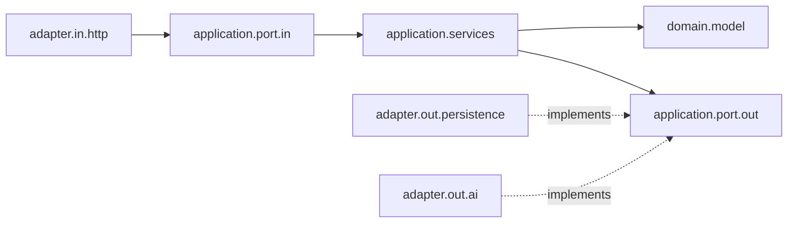

# HRWebApp

[](https://github.com/jacidProgrammer/HRWebApp/actions/workflows/ci.yml)

A small HR backend built with Spring Boot and a hexagonal (ports and adapters) architecture.
It manages employees and peer feedback, secures every endpoint with Keycloak-issued JWTs and
enriches feedback with an AI sentiment score from the Hugging Face inference API.

The React frontend lives in a separate repository: [HRWebApp-UI](https://github.com/jacidProgrammer/HRWebApp-UI).

## Features

- **Employees CRUD with role-based data visibility**
  - `MANAGER` can list, read, create, update and delete employees and always sees every field.
  - `EMPLOYEE` can list employees, but `salary` and `address` are only returned for their own
    profile (matched on the token's `preferred_username`). They can update only their own contact
    details (email, address); department, role and salary can only be changed by a manager.
- **Feedback with sentiment analysis**
  - Employees send feedback about a colleague; the author is the employee matching the token user.
  - The message is classified by a Hugging Face model (default
    `cardiffnlp/twitter-roberta-base-sentiment-latest`) and stored with its `label` and `score`.
  - If the API is unavailable or no token is configured, the failure is logged and the feedback
    is stored without a sentiment (`label`/`score` are `null`).
- **Security**: OAuth2 resource server; Keycloak realm roles mapped to Spring roles; method-level
  authorization with `@PreAuthorize`. Only the API docs, `/public/**` and `/actuator/health` are
  public (plus the H2 console in the `h2` profile).
- **OpenAPI docs** via springdoc at `/swagger-ui.html`.

## Architecture

```
dev.jacid.hrApplication
├── domain.model            Employee, Feedback, Sentiment (plain Java records)
├── application
│   ├── port.in             EmployeesUseCases, FeedbackUseCases
│   ├── port.out            EmployeeRepository, FeedbackRepository, SentimentAnalyzer
│   └── services            use case implementations
├── adapter
│   ├── in.http             REST controllers, JSON DTOs and their MapStruct mappers
│   ├── out.persistence     Spring Data JPA entities/repositories implementing the repository ports
│   └── out.ai              Hugging Face client implementing SentimentAnalyzer
└── infrastructure          security (Keycloak JWT), HTTP client config, error handling
```



The services only talk to ports and domain records. The web DTOs and JPA entities stay in their
adapters and are converted with MapStruct, so the JSON contract and the database schema can change
independently of the use cases.

## Tech stack

- Java 21, Spring Boot 3.5 (Web, Security, OAuth2 Resource Server, Data JPA, Validation, Actuator)
- Keycloak 22 as identity provider
- PostgreSQL 15, H2 for local development
- MapStruct, Lombok
- Spring `RestClient` for the Hugging Face inference API
- springdoc-openapi
- JUnit 5, Mockito, MockMvc, Spring Security Test, Testcontainers, JaCoCo
- GitHub Actions

## Running locally

Requirements: JDK 21 and Docker. Maven is provided by the wrapper (`./mvnw`).

1. **Start Keycloak and the databases**

   ```bash
   docker compose up -d
   ```

   This starts Keycloak on `http://localhost:8082` (admin console: `admin` / `admin`), its own
   PostgreSQL, and the application database on port `5433`. Keycloak imports the `hr-realm` realm
   from [`realm-export/hr-realm.json`](realm-export/hr-realm.json) on startup. The realm defines the
   roles `MANAGER` and `EMPLOYEE` and the demo users `manager` and `Jose`.

   > The client secret, user passwords and admin credentials in `docker-compose.yml`, the realm
   > export and the Postman collection are **demo values for local development only**. Replace them
   > before running this anywhere else.

2. **(Optional) Enable sentiment analysis** with a Hugging Face access token. The token is only
   read from the environment and is never stored in the repository:

   ```bash
   export HUGGINGFACE_TOKEN=hf_xxx
   ```

3. **Run the application** on `http://localhost:8080` with one of the two database profiles:

   | Profile          | Database                   | Data lifecycle                                                                                      |
   |------------------|----------------------------|-----------------------------------------------------------------------------------------------------|
   | `h2` (default)   | in-memory H2               | Recreated and seeded from `import-h2.sql` on every start. H2 console at `/h2-console`.               |
   | `postgres`       | `hrapp-postgres` container | Schema kept up to date by Hibernate (`ddl-auto=update`); `import-postgres.sql` only seeds empty tables, so data survives restarts. |

   ```bash
   ./mvnw spring-boot:run                                              # h2
   ./mvnw spring-boot:run -Dspring-boot.run.profiles=postgres          # PostgreSQL
   ```

4. **Get a token and call the API.** Import
   [`src/main/resources/HR.postman_collection.json`](src/main/resources/HR.postman_collection.json)
   into Postman, send the `Token` request (password grant against `hr-realm`), and use the returned
   `access_token` as Bearer token for the other requests.

## API overview

All endpoints require `Authorization: Bearer <token>`.

| Method | Path                | Role                   | Description                                                   |
|--------|---------------------|------------------------|---------------------------------------------------------------|
| GET    | `/employees`        | `MANAGER`, `EMPLOYEE`  | List employees (sensitive fields filtered by role)            |
| GET    | `/employees/{name}` | `MANAGER`              | Get one employee                                              |
| POST   | `/employees`        | `MANAGER`              | Create an employee                                            |
| PUT    | `/employees/{name}` | `MANAGER`, `EMPLOYEE`  | Update an employee (see rules below)                          |
| DELETE | `/employees/{name}` | `MANAGER`              | Delete an employee                                            |
| GET    | `/feedback`         | `EMPLOYEE`             | List all feedback                                             |
| GET    | `/feedback/{name}`  | `EMPLOYEE`             | Feedback about one employee                                   |
| POST   | `/feedback`         | `EMPLOYEE`             | Send feedback `{"name": "Jose", "message": "..."}`            |

Updating an employee (`PUT /employees/{name}`):

- The path identifies the employee; names cannot be changed. The `name` in the body may be omitted;
  if present it must match the path (case-insensitive), otherwise the request is rejected with `400`.
- A manager replaces all other fields, so the body must contain every field.
- An employee can only update their own profile, and only `email` and `address` (omitted values are
  kept). Department, role and salary may be omitted or sent unchanged; changing them returns `403`.

Errors are returned as `{"code": "...", "message": "..."}`:

| Status | When                                                                                          |
|--------|-----------------------------------------------------------------------------------------------|
| 400    | Missing required fields, body/path name mismatch, feedback without name or message           |
| 401    | Missing or invalid token                                                                      |
| 403    | Role not allowed for the endpoint, updating another employee's or a manager-only field, sending feedback as a user without an employee record |
| 404    | Employee not found                                                                            |
| 409    | Creating an employee whose name already exists                                                |

Example feedback response:

```json
{ "name": "Jose", "message": "Great code reviews!", "score": 0.97, "label": "positive" }
```

Interactive documentation: `http://localhost:8080/swagger-ui.html` (OpenAPI JSON at `/v3/api-docs`).

## Tests and coverage

```bash
./mvnw verify                        # unit + Spring MockMvc tests, JaCoCo report
./mvnw verify -Pintegration-tests    # additionally runs the Testcontainers integration tests (needs Docker)
```

- **Unit tests** (JUnit 5 + Mockito, no Spring): the use case services and the Hugging Face adapter
  (against a mocked HTTP server).
- **Web tests** (`@SpringBootTest` + MockMvc, embedded H2): controllers, role rules and the security
  configuration, e.g. unauthenticated requests get `401`.
- **Integration tests** (`*IT`, Testcontainers PostgreSQL): the JPA adapters, the Hibernate schema and
  the idempotent seed script of the `postgres` profile against a real PostgreSQL.

The coverage report is written to `target/site/jacoco/index.html`. CI runs
`./mvnw -B verify -Pintegration-tests` on every push and pull request to `main`.

## License

[MIT](LICENSE)
