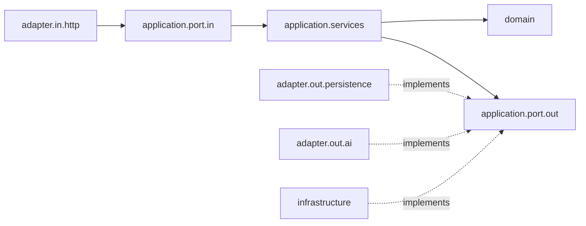

# HRWebApp

[](https://github.com/jacidProgrammer/HRWebApp/actions/workflows/ci.yml)

A small HR backend built with Spring Boot and a hexagonal (ports and adapters) architecture.
It manages employees and peer feedback, secures every endpoint with Keycloak-issued JWTs,
enriches feedback with a sentiment score from the Hugging Face inference API and aggregates it
into a manager dashboard.

The React frontend lives in a separate repository: [HRWebApp-UI](https://github.com/jacidProgrammer/HRWebApp-UI)
(Keycloak login with PKCE, role-aware employee directory, profile editing, feedback and the manager dashboard).

## Features

- **Employees with role-based data visibility**
  - Each employee is linked to a Keycloak user through `username` (compared case-insensitively with the
    token's `preferred_username`). `name` is only a display name: it can change and need not be unique.
  - `MANAGER` can list, read, create, update and delete employees and always sees every field.
  - `EMPLOYEE` can list and read employees, but `salary` and `address` are only returned for their own
    record. They can update only their own contact details (email, address).
- **Peer feedback**
  - Employees send feedback to a colleague (never to themselves), optionally recognising a company value
    (`TEAMWORK`, `OWNERSHIP`, `CRAFT`, `CUSTOMER_FOCUS`, `GROWTH`) and optionally **anonymously**.
  - Employees read the feedback they received and the feedback they sent; they cannot list feedback about
    other people. Managers read and filter all feedback. The author of anonymous feedback is stored (to
    enforce the rules) but only ever returned to the author.
- **Sentiment analysis** of the feedback message with a Hugging Face model (default
  `cardiffnlp/twitter-roberta-base-sentiment-latest`), stored as `{ "label": "POSITIVE|NEUTRAL|NEGATIVE", "score": 0.97 }`.
  Managers can switch it off at runtime (`PUT /settings`); without a token, when switched off or when the API
  fails, feedback is stored with `sentiment: null`.
- **Manager dashboard** (`GET /stats/overview`): headcount per department, feedback volume, sentiment share and
  monthly trend, recognised company values, most recognised employees and alerts when the share of positive
  feedback about someone drops.
- **Security**: OAuth2 resource server; Keycloak realm roles mapped to Spring roles; method-level
  authorization with `@PreAuthorize`. Only the API docs, `/public/**` and `/actuator/health` are
  public (plus the H2 console in the `h2` profile).
- **OpenAPI docs** via springdoc at `/swagger-ui.html`.

## Architecture

```
dev.jacid.hrApplication
├── domain
│   ├── model               Employee, Feedback, Sentiment, AppSettings, filters and dashboard records (plain Java)
│   └── service             EmployeeUpdatePolicy, StatsCalculator (dashboard aggregation, no I/O)
├── application
│   ├── port.in             EmployeesUseCases, FeedbackUseCases, StatsUseCases, SettingsUseCases
│   ├── port.out            EmployeeRepository, FeedbackRepository, SettingsRepository, SentimentAnalyzer,
│   │                       CurrentUserProvider, TimeProvider
│   └── services            use case implementations (visibility rules, sentiment gate)
├── adapter
│   ├── in.http             REST controllers, JSON DTOs and their MapStruct mappers
│   ├── out.persistence     Spring Data JPA entities/repositories implementing the repository ports
│   └── out.ai              Hugging Face client implementing SentimentAnalyzer
└── infrastructure          security (Keycloak JWT), clock, demo data seeder, HTTP client config, error handling
```



The services only talk to ports and domain objects. The web DTOs and JPA entities stay in their
adapters and are converted with MapStruct, so the JSON contract and the database schema can change
independently of the use cases.

## Tech stack

- Java 21, Spring Boot 3.5 (Web, Security, OAuth2 Resource Server, Data JPA, Validation, Actuator)
- Keycloak 26 as identity provider
- PostgreSQL 15, H2 for local development, Flyway migrations
- MapStruct, Lombok
- Spring `RestClient` for the Hugging Face inference API
- springdoc-openapi
- JUnit 5, Mockito, MockMvc, Spring Security Test, Testcontainers, JaCoCo
- GitHub Actions

## Running locally

Requirements: JDK 21 and Docker. Maven is provided by the wrapper (`./mvnw`).

1. **Start Keycloak and the databases**

   ```bash
   docker compose up -d
   ```

   This starts Keycloak 26 on `http://localhost:8082` (admin console: `admin` / `admin`), its own
   PostgreSQL, and the application database on port `5433`. Keycloak imports the `hr-realm` realm
   from [`realm-export/hr-realm.json`](realm-export/hr-realm.json) on startup. The realm defines:

   - the realm roles `MANAGER` and `EMPLOYEE`, which reach the API in the token's `realm_access.roles` claim;
   - the public client `hr-api-login`: authorization code flow with PKCE (S256) for the
     [HRWebApp-UI](https://github.com/jacidProgrammer/HRWebApp-UI) single-page app (redirect URIs
     `http://localhost:5173/*`, web origin `http://localhost:5173`), plus the password grant used by the
     Postman collection;
   - the demo users (password `1234` for all of them). Their usernames match the `username` of the demo
     employees:

     | User      | Role       | Employee record                  |
     |-----------|------------|----------------------------------|
     | `manager` | `MANAGER`  | none                             |
     | `jose`    | `EMPLOYEE` | José Antonio Cid (IT)            |
     | `louisa`  | `EMPLOYEE` | Louisa Becker (IT)               |
     | `maria`   | `EMPLOYEE` | María García (Sales)             |
     | `lukas`   | `EMPLOYEE` | Lukas Schneider (IT)             |

   Keycloak only imports the realm when it does not exist yet.

   > **Upgrading from the previous version** (Keycloak 22, numeric ids, names as identity): both databases
   > must be recreated, because the realm changed and the application schema is now managed by Flyway.
   > Run `docker compose down -v && docker compose up -d`.

   > The user passwords and admin credentials in `docker-compose.yml`, the realm
   > export and the Postman collection are **demo values for local development only**. Replace them
   > before running this anywhere else.

2. **(Optional) Enable sentiment analysis** with a Hugging Face access token. The token is only
   read from the environment and is never stored in the repository:

   ```bash
   export HUGGINGFACE_TOKEN=hf_xxx
   ```

   `GET /settings` reports whether a token is configured (`sentimentAnalysisAvailable`) and whether managers
   enabled the analysis (`sentimentAnalysisEnabled`, stored in the database, enabled by default).

3. **Run the application** on `http://localhost:8080` with one of the two database profiles:

   | Profile          | Database                   | Data lifecycle                                                                                      |
   |------------------|----------------------------|-----------------------------------------------------------------------------------------------------|
   | `h2` (default)   | in-memory H2               | Created by Flyway and filled with demo data on every start, lost on shutdown. H2 console at `/h2-console`. |
   | `postgres`       | `hrapp-postgres` container | Flyway applies pending migrations on startup; the demo data is only inserted while the `employees` table is empty, so data survives restarts. |

   ```bash
   ./mvnw spring-boot:run                                              # h2
   ./mvnw spring-boot:run -Dspring-boot.run.profiles=postgres          # PostgreSQL
   ```

   The schema lives in [`src/main/resources/db/migration`](src/main/resources/db/migration) (portable SQL for
   PostgreSQL and H2); Hibernate only validates it (`ddl-auto=validate`). Schema changes are new
   `V<n>__*.sql` files. The demo data (`DemoDataSeeder`: 12 employees in IT, Sales, People and Finance, 50
   feedback items over the last six months with pre-set sentiment, a few anonymous, one sentiment alert) is
   generated relative to the current date. Turn it off with `app.seed.demo-data=false` (the `prod` build does).

4. **Get a token and call the API.** Import
   [`src/main/resources/HR.postman_collection.json`](src/main/resources/HR.postman_collection.json)
   into Postman, set the collection variable `username` (`manager`, `jose`, ...), send the `Token` request
   (password grant against `hr-realm`); it stores the access token and every other request uses it.

5. **(Optional) Run the frontend.** Follow the [HRWebApp-UI README](https://github.com/jacidProgrammer/HRWebApp-UI#running-it-with-the-backend):
   `npm install && npm run dev` serves it on `http://localhost:5173` and signs you in through Keycloak.

   Browsers may only call the API from allowed origins. CORS is configured with `app.cors.allowed-origins`
   (a comma-separated list, default `http://localhost:5173`), which you can override with an environment variable:

   ```bash
   CORS_ALLOWED_ORIGINS=https://hr.example.com,http://localhost:5173 ./mvnw spring-boot:run
   ```

## API overview

All endpoints require `Authorization: Bearer <token>`. Ids are UUIDs, dates are ISO-8601 UTC strings
(`2026-09-21T10:15:30Z`).

### Employees

```json
{ "id": "uuid", "username": "jose", "name": "José Antonio Cid", "department": "IT", "role": "Java Senior Backend",
  "email": "jose@example.com", "salary": 75600.0, "address": "Mainz, Germany", "createdAt": "2025-08-17T19:20:12Z" }
```

| Method | Path               | Role                  | Description                                                                 |
|--------|--------------------|-----------------------|-----------------------------------------------------------------------------|
| GET    | `/employees`       | `MANAGER`, `EMPLOYEE` | All employees; `salary`/`address` are `null` unless manager or own record   |
| GET    | `/employees/me`    | `MANAGER`, `EMPLOYEE` | The employee linked to the caller's username; `404` if there is none        |
| GET    | `/employees/{id}`  | `MANAGER`, `EMPLOYEE` | One employee (same visibility rule)                                         |
| POST   | `/employees`       | `MANAGER`             | Create: `username, name, department, role, email, salary, address` (all required); `201` |
| PUT    | `/employees/{id}`  | `MANAGER`, `EMPLOYEE` | Update (rules below)                                                        |
| DELETE | `/employees/{id}`  | `MANAGER`             | Delete; `204`                                                               |

- `username` is unique (case-insensitive, stored in lower case), must look like a Keycloak username
  (letters, digits, `. _ @ -`) and never changes.
- A manager replaces every field except `username`, so the body must contain all of them. A `username` in the
  body is only accepted if it is the current one (otherwise `400`).
- An employee can only update their own record and only `email` and `address` (omitted values are kept).
  Other fields may be omitted or sent unchanged; changing them returns `403`, as does updating someone else.
- **Deleting an employee** deletes the feedback **about** them and keeps the feedback they **wrote** with
  `authorId`/`authorName` = `null`, so their colleagues keep what they received.

### Feedback

```json
{ "id": "uuid", "recipientId": "uuid", "recipientName": "Louisa Becker", "authorId": "uuid", "authorName": "José Antonio Cid",
  "anonymous": false, "value": "TEAMWORK", "message": "Great facilitation!",
  "sentiment": { "label": "POSITIVE", "score": 0.97 }, "createdAt": "2026-09-21T10:15:30Z" }
```

| Method | Path                 | Role       | Description                                                                          |
|--------|----------------------|------------|--------------------------------------------------------------------------------------|
| POST   | `/feedback`          | `EMPLOYEE` | Send `{ "recipientId", "message", "value"?, "anonymous"? }`; `201`                   |
| GET    | `/feedback/received` | `EMPLOYEE` | Feedback about the caller, newest first                                              |
| GET    | `/feedback/sent`     | `EMPLOYEE` | Feedback written by the caller, newest first (author always filled in)               |
| GET    | `/feedback`          | `MANAGER`  | All feedback, newest first. Optional filters below                                   |

- The caller of `POST /feedback`, `/received` and `/sent` needs an employee record (`403` otherwise).
  `message` must have 1 to 500 characters (surrounding whitespace is removed), `value` is optional,
  `anonymous` defaults to `false`. Feedback to yourself is `400`, an unknown recipient `404`.
- `authorId`/`authorName` are `null` for anonymous feedback, for everybody including managers. The only
  exception is the author: `/feedback/sent` and the `POST` response show it.
- `sentiment` is `null` when the analysis is disabled, failed, or no token is configured.
- Filters of `GET /feedback`: `recipientId`, `department` (case-insensitive), `from` and `to` (inclusive; a date
  such as `2026-09-01` means the whole UTC day, or a date-time such as `2026-09-01T10:15:30Z`), `sentiment`
  (`POSITIVE`, `NEUTRAL`, `NEGATIVE`, or `NONE` for feedback without sentiment).

### Dashboard and settings

| Method | Path              | Role                  | Description                                                                 |
|--------|-------------------|-----------------------|-----------------------------------------------------------------------------|
| GET    | `/stats/overview` | `MANAGER`             | Dashboard figures; optional `months` (default 6, 1..12)                     |
| GET    | `/settings`       | `MANAGER`, `EMPLOYEE` | `{ "sentimentAnalysisEnabled": true, "sentimentAnalysisAvailable": false }` |
| PUT    | `/settings`       | `MANAGER`             | `{ "sentimentAnalysisEnabled": false }`, returns the settings               |

`GET /stats/overview` (all months are UTC calendar months):

| Field            | Meaning                                                                                                   |
|------------------|-----------------------------------------------------------------------------------------------------------|
| `headcount`, `departments` | Number of employees, in total and per department                                                |
| `feedback`       | Feedback created this month, last month, and in total                                                     |
| `sentimentShare` | Share (0..1, two decimals) of positive / neutral / negative / not analysed feedback in the selected `months` |
| `trend`          | One entry per month of the selected period, oldest first, zero-filled                                     |
| `valueCounts`    | Every company value with the number of feedback items recognising it in the selected period, most frequent first |
| `topRecognised`  | The 5 employees with most feedback received in the last 90 days, with their positive share (positive / analysed) |
| `alerts`         | Employees whose positive share in the last 30 days dropped by ≥ 0.25 compared with the 30 days before, with ≥ 3 analysed items in each window. `feedbackCount` is the number of items in the last 30 days. No message content |

### Errors

Errors are returned as `{"code": "...", "message": "..."}`:

| Status | When                                                                                          |
|--------|-----------------------------------------------------------------------------------------------|
| 400    | Missing required fields, changing a username, invalid feedback (message length, feedback to yourself, unknown value), malformed ids, JSON or filters, `months` outside 1..12 |
| 401    | Missing or invalid token                                                                      |
| 403    | Role not allowed for the endpoint, updating another employee or a manager-only field, sending/reading feedback without an employee record |
| 404    | Employee not found, `/employees/me` without employee record                                   |
| 409    | Creating an employee whose username already exists                                            |

Interactive documentation: `http://localhost:8080/swagger-ui.html` (OpenAPI JSON at `/v3/api-docs`).

## Privacy and GDPR

Feedback about colleagues is personal data, and sentiment scores derived from it can be used to assess
people. The application is built to keep that to what the feature needs. This is a technical description,
not legal advice.

- **Only free text is analysed.** The sentiment model only receives the text of the feedback message (no ids,
  author, recipient or other employee data), once, when the feedback is created.
- **Managers can switch the analysis off** (`PUT /settings`). While it is off, nothing is sent to Hugging Face
  and new feedback is stored without sentiment. Without a configured token nothing is sent either.
- **Anonymous feedback stays anonymous.** The author is stored only to enforce rules such as "no feedback to
  yourself"; the API never returns it to anybody but the author, managers included.
- **Managers see aggregates and messages, not profiles.** The dashboard shows counts and shares; alerts only
  say that the share of positive feedback about someone dropped, with no message content, and require a
  minimum number of analysed items so a single message cannot trigger them.
- **Data minimisation.** Employees only see their own received and sent feedback, and salary and address only
  of their own record. Deleting an employee deletes the feedback about them and removes them as author of
  what they wrote.
- **Before real use**, note that in Germany a tool able to monitor employees' behaviour or performance is
  subject to the works council's co-determination (§87(1) no. 6 BetrVG), and that a data protection impact
  assessment (GDPR Art. 35) is advisable for automated analysis of employee feedback.

## Tests and coverage

```bash
./mvnw verify                        # unit + Spring MockMvc tests, JaCoCo report
./mvnw verify -Pintegration-tests    # additionally runs the Testcontainers integration tests (needs Docker)
```

- **Unit tests** (JUnit 5 + Mockito, no Spring): the domain rules (update policy, dashboard aggregation with a
  fixed clock: trend zero-fill, alert thresholds, top recognised), the use case services (visibility of
  anonymous authors, sentiment gate) and the Hugging Face adapter (against a mocked HTTP server).
- **Web tests** (`@SpringBootTest` + MockMvc, embedded H2 with the Flyway schema and the demo data, mocked JWTs):
  every endpoint and the role matrix, the security configuration, e.g. unauthenticated requests get `401`.
  Each test is rolled back.
- **Integration tests** (`*IT`, Testcontainers PostgreSQL): the Flyway migrations, Hibernate schema validation,
  the JPA adapters and queries, the demo data seeder, and the API on top of PostgreSQL.

The coverage report is written to `target/site/jacoco/index.html`. CI runs
`./mvnw -B verify -Pintegration-tests` on every push and pull request to `main`.

## License

[MIT](LICENSE)
